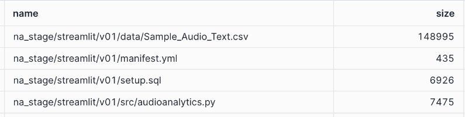
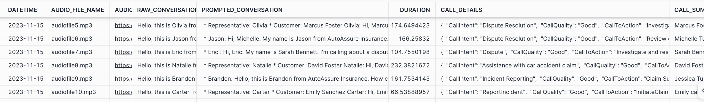

# snowflake-na-cortex
Demo on how to use cortex LLM function with native apps to build Gen AI apps

## Steps

This demo has the steps to use cortex LLM functions in a Native App and code_schema.load_data SP is using the cortex llm functions. Run the below commands from SQL Worksheet. 

```sql

use role accountadmin;


GRANT CREATE APPLICATION PACKAGE ON ACCOUNT TO ROLE SPCS_PSE_ROLE;
GRANT CREATE APPLICATION ON ACCOUNT TO ROLE SPCS_PSE_ROLE;
GRANT CREATE INTEGRATION ON ACCOUNT TO ROLE SPCS_PSE_ROLE;

USE ROLE SPCS_PSE_ROLE;

-- drop INTEGRATION tutorial_integration;

CREATE SECURITY INTEGRATION IF NOT EXISTS streamlit_integration
  TYPE=oauth
  OAUTH_CLIENT=snowservices_ingress
  ENABLED=true;

  show INTEGRATIONs;


-- drop application package pr_streamlit_package;

CREATE APPLICATION PACKAGE pr_cortex_na_package;

USE DATABASE pr_cortex_na_package;

-- Upload all the files required for the native app in following folder
LIST @pr_call_centre_analytics_db.public.na_stage/streamlit/v01/;

-- Below screenshot has the files uploaded

```



```sql

show application packages like 'pr%';

-- Check the package version after uploading the files
 SHOW VERSIONS IN APPLICATION PACKAGE pr_cortex_na_package;

-- Adding version to the package
ALTER APPLICATION PACKAGE pr_cortex_na_package
  ADD VERSION "v1_0"
  USING @pr_call_centre_analytics_db.public.na_stage/streamlit/v01;

-- Creating App from the package
CREATE APPLICATION pr_call_centre_analytics_app
  FROM APPLICATION PACKAGE pr_cortex_na_package
  USING VERSION "v1_0";

DESC APPLICATION pr_call_centre_analytics_app;

-- Grant the below permission to the app. This is required to use cortex LLM functions
GRANT IMPORTED PRIVILEGES ON DATABASE SNOWFLAKE TO APPLICATION pr_call_centre_analytics_app


```

### Invoked the SP to copy data and load data into required tables in the app

```sql
-- There should be no files
 ls @pr_call_centre_analytics_app.app_public.data_stage;

 -- Loads the data in required tables. This fuctions uses the cortex LLM fucntions
 CALL pr_call_centre_analytics_app.code_schema.load_data();

```

### Validating the loaded tables

```sql

SELECT * FROM  pr_call_centre_analytics_app.app_public.All_Claims_raw;

SELECT * FROM pr_call_centre_analytics_app.app_public.TRANSCRIPT_INFO_EXTRACTED_QA;

SELECT * FROM  pr_call_centre_analytics_app.app_public.AUDIO_CLAIMS_EXTRACTED_INFO;

```

